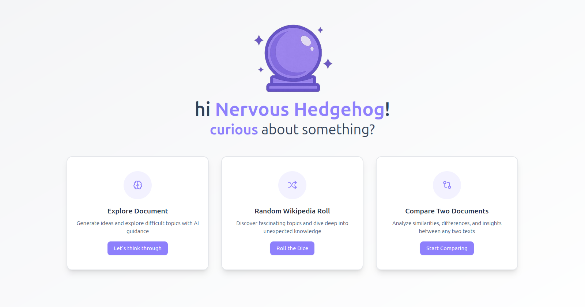

# Project June


## What is Project June?



Project June is actually an exploratory project aimed at understanding AI-integrated web development, and for a more focused view: how LLM wrappers are constructed. From a user's POV, the project is just an agent that can help one brainstorm a particular document. So, essentially, this is a TYPICAL project, nothing special or innovative but just a good way to get started with these uncharted concepts of the new era.

## Why Project June?

If the 'why' is about the name 'Project June':
The project was a summer initiative for me in June, which is why it is called 'June'.

If the 'why' is about the motivation that drove me:
The project was fuelled by the void that existed in my mind when the term 'AI' emerged. So, to fill that void, Project June was incepted.

## How to install it locally?

Tho, there is no solid reason for anyone to install it, still if one insists on taking a look at how things are wired inside, one can follow these commands:

```
git clone https://github.com/suu-b/Project-June.git
cd Project-June
cd ./client
// add .env for client using ./client/.env.example
npm run dev //to run client

cd ./server
// add .env for server using ./server/.env.example
npm run dev //to run development server
```

## A look at the tech stack?

The tech stack is `MERN` with `Langchain` for AI integration, `HuggingFace` for vector store and embeddings, and `Gemini` for LLM and NLP. Moreover, as an add-on, I've implemented an external search facility for the LLM so that it can respond to real-time queries, for that, `serpapi` is used. For parsing of markdown responses and HTML components, `ReactHtmlParser` and `marked` are used. And for great UI components, `shadcn` was a great help.

## Future

There is a compare documents feature pending which will be implemented shortly. Apart from this, I've a few broad ideas in my mind which would take a considerable time to motivate me to plan and eventually implement them. After their implementation, this project wouldn't remain a TYPICAL one but a thoughtful, refined, and well-implemented TYPICAL one.
